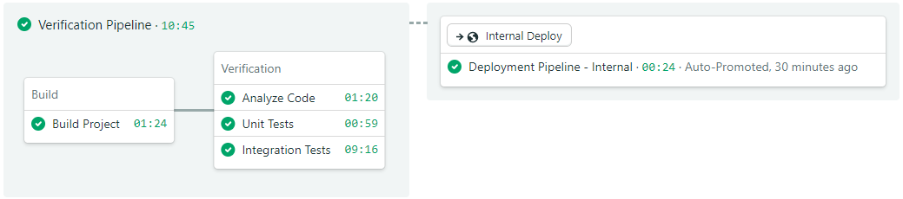

# Semaphore demo CI/CD pipeline for Android
This is an example project and CI/CD pipeline showing how to build, test, and
deploy an Android application using Semaphore 2.0.

**Note:** Please note that the `fork-and-run` branch has simplified Semaphore configuration with empty deployment pipelines.  
If you already have some experience with Semaphore please check the configuration in the `dev` branch on which Semaphore is fully configured to deploy to the Google Play Store.

## CI/CD on Semaphore
If you're new to Semaphore, feel free to fork this repository and use it to
[create your own
project](https://docs.semaphoreci.com/guided-tour/creating-your-first-project/).

## License
Copyright (c) 2020 Rendered Text

Distributed under the MIT License. See the file [LICENSE](LICENSE).
