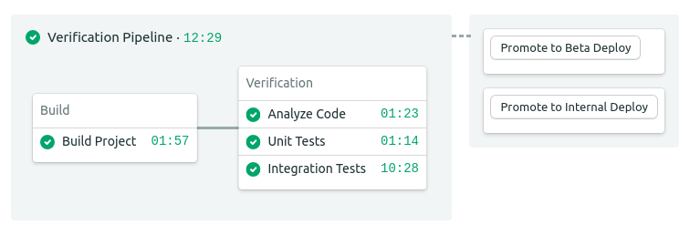

# Semaphore demo CI/CD pipeline for Android
This is an example project and CI/CD pipeline showing how to build, test, and
deploy an Android application using Semaphore 2.0.

## CI/CD on Semaphore
If you're new to Semaphore, feel free to fork this repository and use it to
[create your own
project](https://docs.semaphoreci.com/guided-tour/creating-your-first-project/).

## Project Setup
- Create a [new
  keystore](https://developer.android.com/studio/publish/app-signing) and update
  the [release signing config](app/build.gradle).
- Create a Google Play Store [Developer
  account](https://play.google.com/apps/publish) to deploy your app to the
  store.
- Create a [Service
  Account](https://github.com/Triple-T/gradle-play-publisher/#service-account)
  to use with [Gradle Play Publisher
  plugin](https://github.com/Triple-T/gradle-play-publisher/).
- Add your keystore passwords and the keystore and service account files to
  [Semaphore Secrets](https://docs.semaphoreci.com/essentials/using-secrets/).

## License
Copyright (c) 2020 Rendered Text

Distributed under the MIT License. See the file [LICENSE](LICENSE).
